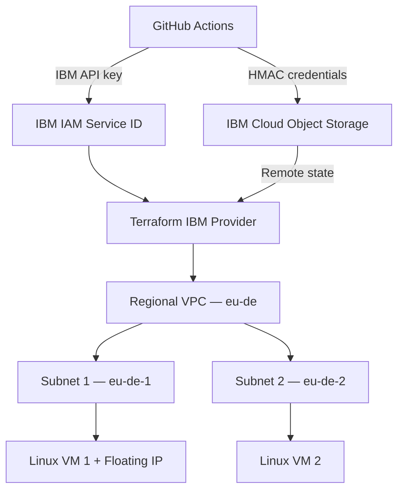

# IBM Cloud Terraform Lab

Hands-on infrastructure automation project that provisions and manages a multi-zone IBM Cloud VPC environment using Terraform and GitHub Actions.

The project demonstrates infrastructure as code, remote state management in IBM Cloud Object Storage, IAM-based automation, security group configuration, drift detection, and CI validation and planning.

## Project objectives

- Provision IBM Cloud VPC infrastructure with Terraform.
- Deploy Linux virtual server instances across two availability zones.
- Control network access through security group rules.
- Store Terraform state remotely in IBM Cloud Object Storage.
- Separate provider authentication from backend authentication.
- Validate and plan infrastructure changes through GitHub Actions.
- Keep credentials, local variables and Terraform state outside the repository.
- Demonstrate Terraform drift detection and recovery.

## Architecture



The Terraform configuration uses an existing IBM Cloud Resource Group and creates the VPC infrastructure inside it.

## Provisioned resources

| Component | Terraform resource | Purpose |
|---|---|---|
| Existing Resource Group | `data.ibm_resource_group.lab` | Locates the target IBM Cloud Resource Group |
| Regional VPC | `ibm_is_vpc.lab` | Provides the isolated virtual network |
| Subnet 1 | `ibm_is_subnet.lab1` | Hosts the first VM in one availability zone |
| Subnet 2 | `ibm_is_subnet.lab2` | Hosts the second VM in another availability zone |
| Security Group | `ibm_is_security_group.lab` | Controls inbound and outbound network traffic |
| SSH key | `ibm_is_ssh_key.lab` | Enables SSH authentication to Linux instances |
| Linux VM 1 | `ibm_is_instance.lab1` | First virtual server instance |
| Linux VM 2 | `ibm_is_instance.lab2` | Second virtual server instance |
| Floating IP | `ibm_is_floating_ip.lab1` | Provides controlled external access to VM 1 |

The Ubuntu image is discovered dynamically through:

```hcl
data "ibm_is_image" "ubuntu"
```

This avoids hard-coding an image ID that may change between regions or image releases.

## Network security

The project defines the following Security Group rules:

| Rule | Direction | Source | Purpose |
|---|---|---|---|
| `outbound_all` | Outbound | VPC resources | Allows outbound connectivity |
| `ping_from_subnet1` | Inbound | Subnet 1 | Allows internal ICMP testing |
| `ping_from_subnet2` | Inbound | Subnet 2 | Allows internal ICMP testing |
| `ssh_from_admin` | Inbound | Configured administrator CIDR | Allows controlled administrative SSH access |
| `ssh_from_subnet1` | Inbound | Subnet 1 | Allows SSH communication from the first subnet |

Only the first VM receives a Floating IP. The second VM remains accessible through the internal VPC network according to the Security Group rules.

## Remote Terraform state

Terraform state is stored in an IBM Cloud Object Storage bucket through Terraform's S3-compatible backend.

```text
Backend type: s3
Region:       eu-de
Bucket:       tfstate-ibm-lab-donald-2026
State key:    ibm-cloud-terraform-lab/terraform.tfstate
```

State locking is enabled with:

```hcl
use_lockfile = true
```

Terraform creates a temporary lock object while operating on the state. This prevents concurrent workflows from modifying the same state simultaneously.

The backend uses the IBM COS regional S3 endpoint:

```text
https://s3.eu-de.cloud-object-storage.appdomain.cloud
```

The COS bucket and its HMAC credential are bootstrap dependencies and are managed separately from this Terraform root module.

## Authentication model

Provider access and backend access use separate identities and protocols.

| Purpose | Identity/credential | GitHub secret or environment variable |
|---|---|---|
| IBM Terraform provider | IBM Service ID API key | `IC_API_KEY` |
| COS backend access key | HMAC access key ID | `COS_HMAC_ACCESS_KEY_ID` |
| COS backend secret | HMAC secret access key | `COS_HMAC_SECRET_ACCESS_KEY` |
| VM SSH configuration | SSH public key | `SSH_PUBLIC_KEY` |

### IBM provider authentication

The IBM Terraform provider uses:

```text
IC_API_KEY
→ IBM IAM
→ temporary bearer token
→ IBM Cloud APIs
```

The API key belongs to a dedicated IBM Service ID rather than a personal interactive user account.

### COS backend authentication

The S3-compatible backend uses:

```text
HMAC access key + secret key
→ AWS Signature Version 4
→ IBM Cloud Object Storage
```

Terraform receives these values through the standard S3 environment variables:

```text
AWS_ACCESS_KEY_ID
AWS_SECRET_ACCESS_KEY
```

### SSH public key handling

The local Terraform configuration receives the path of an existing public key through:

```hcl
variable "ssh_public_key_path"
```

In GitHub Actions, the runner creates a temporary `.pub` file from the `SSH_PUBLIC_KEY` repository secret. Its path is passed to Terraform through:

```text
TF_VAR_ssh_public_key_path
```

The temporary file is discarded when the GitHub-hosted runner is removed.

No private SSH key is stored or required by Terraform.

## CI workflows

### Terraform Validate

File:

```text
.github/workflows/terraform-validate.yml
```

This workflow performs static validation without connecting to the remote backend:

```text
Checkout
→ Set up Terraform
→ terraform init -backend=false
→ terraform fmt -check
→ terraform validate
```

Because the backend is disabled, this workflow does not require access to IBM COS or the deployed infrastructure.

### Terraform Plan

File:

```text
.github/workflows/terraform-plan.yml
```

This workflow is started manually through `workflow_dispatch` and performs an authenticated plan:

```text
Checkout
→ Set up Terraform
→ Create temporary SSH public key file
→ Terraform Init
→ Terraform Format
→ Terraform Validate
→ Terraform Plan
```

It uses:

- `IC_API_KEY` for the IBM Terraform provider;
- COS HMAC credentials for the remote S3 backend;
- `SSH_PUBLIC_KEY` to create the temporary public-key file.

Workflow concurrency is restricted through:

```yaml
concurrency:
  group: ibm-terraform-state
  cancel-in-progress: false
```

This prevents two Terraform plan operations from using the same remote state simultaneously.

The workflow was verified successfully with:

```text
No changes. Your infrastructure matches the configuration.
```

It also acquired and released the remote state lock correctly.

The current workflows do not execute `terraform apply` and cannot modify the infrastructure.

## Repository structure

```text
ibm-cloud-terraform-lab/
├── .github/
│   └── workflows/
│       ├── terraform-plan.yml
│       └── terraform-validate.yml
├── terraform/
│   ├── .terraform.lock.hcl
│   ├── backend.tf
│   ├── compute.tf
│   ├── main.tf
│   ├── outputs.tf
│   ├── providers.tf
│   ├── security-rules.tf
│   ├── ssh-key.tf
│   ├── terraform.tfvars.example
│   └── variables.tf
├── .gitignore
└── README.md
```

### Terraform files

| File | Purpose |
|---|---|
| `backend.tf` | Configures the IBM COS S3-compatible remote backend |
| `providers.tf` | Defines Terraform and IBM provider requirements |
| `main.tf` | Defines the Resource Group lookup, VPC, subnets, Security Group and Floating IP |
| `compute.tf` | Discovers the Ubuntu image and creates the two virtual server instances |
| `security-rules.tf` | Defines inbound and outbound Security Group rules |
| `ssh-key.tf` | Registers the SSH public key in IBM Cloud |
| `variables.tf` | Declares configurable infrastructure inputs |
| `outputs.tf` | Exposes selected resource names, IDs and the VM Floating IP |
| `terraform.tfvars.example` | Documents example variable values without storing local configuration |
| `.terraform.lock.hcl` | Locks the selected provider versions |

## Input variables

The root module accepts variables for:

- IBM Cloud Resource Group;
- IBM Cloud region;
- VPC name;
- subnet names, CIDR ranges and availability zones;
- Security Group name;
- administrator CIDR;
- IBM Cloud SSH key name;
- local SSH public-key path;
- Ubuntu image name;
- virtual server profile;
- VM names.

Copy the example file for local use:

```powershell
Copy-Item `
    'terraform\terraform.tfvars.example' `
    'terraform\terraform.tfvars'
```

Review and replace the example values before running Terraform.

The real `terraform.tfvars` file is intentionally excluded from Git.

## Outputs

The configuration exposes:

- Resource Group name and ID;
- VPC name and ID;
- both subnet names and IDs;
- Security Group name and ID;
- IBM Cloud SSH key ID;
- Floating IP assigned to the first VM.

To display them locally:

```powershell
terraform -chdir=terraform output
```

## Local workflow

### Prerequisites

- IBM Cloud account;
- existing IBM Cloud Resource Group;
- IBM Service ID with the required IAM permissions;
- IBM Cloud Object Storage bucket;
- COS HMAC credentials;
- Terraform CLI;
- Git;
- local SSH public key.

The following environment variables must be loaded securely before initialization:

```text
IC_API_KEY
AWS_ACCESS_KEY_ID
AWS_SECRET_ACCESS_KEY
```

Run the Terraform lifecycle from the repository root:

```powershell
terraform -chdir=terraform init
terraform -chdir=terraform fmt -recursive
terraform -chdir=terraform validate
terraform -chdir=terraform plan
```

Review the complete plan before performing any infrastructure-changing operation.

## Security practices

- No API keys, HMAC secrets or private SSH keys are stored in the repository.
- GitHub credentials are stored as encrypted repository secrets.
- Local credentials are stored outside the repository.
- Local `terraform.tfvars` files are excluded from Git.
- Terraform state is stored remotely in IBM Cloud Object Storage.
- State locking protects concurrent operations.
- The provider identity and backend identity are separated.
- The IBM provider uses a dedicated Service ID.
- Administrative SSH access is restricted through `admin_cidr`.
- Only one VM receives a Floating IP.
- The GitHub Actions workflows currently perform validation and planning only.
- `.terraform.lock.hcl` is committed to ensure reproducible provider selection.

## Tested scenarios

The project has been tested for:

- initial IBM Cloud infrastructure provisioning;
- deployment across two availability zones;
- SSH access through a Floating IP;
- internal communication controlled by Security Group rules;
- migration from local Terraform state to IBM COS remote state;
- state locking through the S3-compatible backend;
- drift detection after manual resource deletion;
- recreation of missing resources through Terraform;
- local `terraform plan` returning no changes;
- GitHub Actions validation without backend access;
- authenticated GitHub Actions planning against remote state;
- temporary SSH public-key injection on the GitHub runner.

## Possible improvements

Future versions may add:

- saved Terraform plan artifacts;
- a protected `terraform apply` workflow;
- GitHub Environment approval before deployment;
- separate development and production environments;
- reusable Terraform modules;
- IBM Cloud monitoring, logging and alerts;
- VPC Flow Logs;
- private administrative access through VPN or bastion architecture;
- automated compliance and security scanning;
- automated credential rotation;
- a separate Terraform bootstrap project for the COS backend.

## Current status

The infrastructure, remote state and GitHub Actions plan workflow are operational.

The most recent authenticated plan completed successfully with:

```text
No changes. Your infrastructure matches the configuration.
```
